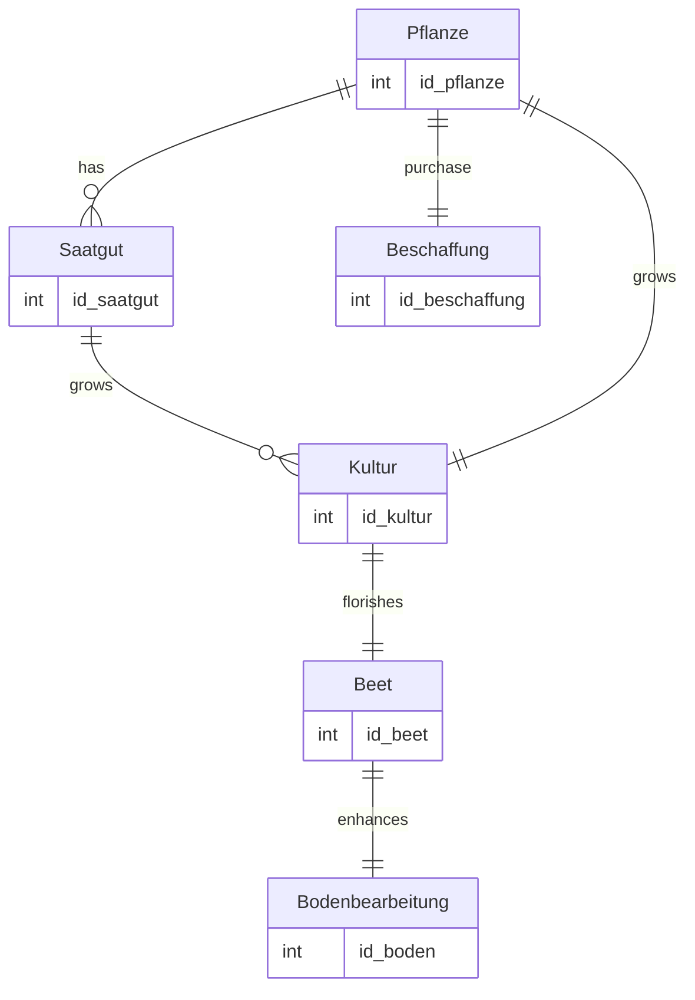

```mermaid

erDiagram
    Pflanze ||--o{ Saatgut : has
    Pflanze ||--|| Beschaffung : purchase
    Pflanze {
        int id_pflanze
    }
    Saatgut ||--o{ Kultur : grows
    Saatgut {
        int id_saatgut
    }
    Kultur ||--|| Pflanze : grows
    Kultur ||--|| Beet : florishes
    Kultur {
        int id_kultur
    }
    Beschaffung {
        int id_beschaffung
    }
    Beet ||--|| Bodenbearbeitung : enhances
    Beet {
        int id_beet
    }
    Bodenbearbeitung {
        int id_boden
    }

```
